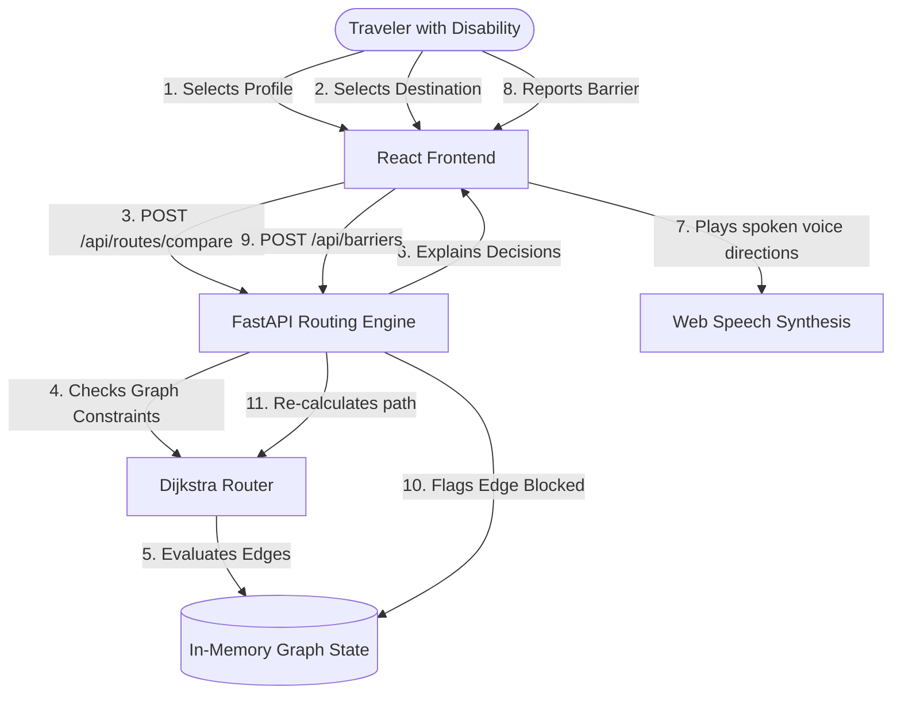

# System Architecture — AccessPath Phase 2 Prototype

This document outlines the software design, routing engine weights, and data representations for AccessPath.

## System Block Diagram



## Accessibility Route Data Model

Each segment (edge) in our path graph carries specific metadata:
- `stairs_count` (int): Number of steps on the path.
- `ramp_available` (bool): Presence of wheelchair-accessible transition ramp.
- `slope_pct` (float): Slope incline percentage.
- `path_width` (float): Minimum width clearance in metres.
- `lighting_level` (str: high, medium, low): Illuminance condition.
- `temp_barrier_status` (bool): Temporary blockages.

## Profile Routing Rules

### 1. Wheelchair Mode
- **Hard Rejections:** `stairs_count > 0`, `temp_barrier_status == True`, `path_width < 1.2`
- **Soft Penalties:** `slope_pct > 5.0` (unless `ramp_available == True`)

### 2. Low Vision Mode
- **Hard Rejections:** `temp_barrier_status == True`
- **Soft Penalties:** `lighting_level == "low"` (dim sections), complex routes with more than 3 junctions.

### 3. Elderly Mode
- **Hard Rejections:** `stairs_count > 5` (strenuous steps), `temp_barrier_status == True`
- **Soft Penalties:** `slope_pct > 4.0`

### 4. Temporary Injury Mode
- **Hard Rejections:** `stairs_count > 0`, `temp_barrier_status == True`
- **Soft Penalties:** `slope_pct > 4.0`

## Accessibility Scoring Formula

The accessibility score ($S$) is calculated out of 100:
- Start with base score of 100.
- Deductions applied for profile violations:
  - Wheelchair stairs: -60
  - Narrow path width: -15
  - High slope: -10 (if ramp present) or -40 (if no ramp)
  - Dark lighting: -20
  - Temporary barrier: score set to 0.

## Information Freshness and Confidence

Confidence is calculated based on:
1. **Verification Age:** Timestamp compared to current date.
2. **Reporter Source:** Survey team reports are marked **High**, crowdsourced reports are verified and initially marked **High** for barrier existence, but drop standard route confidence to **Low** if unverified.
- **High Confidence:** Information verified in the last 24h, or path attributes are permanent structural parameters.
- **Medium Confidence:** Surveyed in the last 7 days.
- **Low Confidence:** Information older than 7 days, or unverified crowdsourced warnings.

## Future Supabase PostgreSQL + PostGIS Schemas

We design the in-memory models so they map directly to database tables in Phase 3:

```sql
CREATE EXTENSION postgis;

-- Profile Definitions
CREATE TABLE accessibility_profiles (
    id VARCHAR(50) PRIMARY KEY,
    name VARCHAR(100) NOT NULL,
    rules JSONB NOT NULL
);

-- Node Table
CREATE TABLE graph_nodes (
    id VARCHAR(50) PRIMARY KEY,
    name VARCHAR(100) NOT NULL,
    geom GEOMETRY(Point, 4326) NOT NULL
);

-- Edge Table with PostGIS Linestrings
CREATE TABLE graph_edges (
    id VARCHAR(50) PRIMARY KEY,
    source_node_id VARCHAR(50) REFERENCES graph_nodes(id),
    target_node_id VARCHAR(50) REFERENCES graph_nodes(id),
    distance NUMERIC(6, 2) NOT NULL,
    stairs_count INT DEFAULT 0,
    ramp_available BOOLEAN DEFAULT FALSE,
    slope_pct NUMERIC(4, 2) DEFAULT 0.00,
    path_width NUMERIC(3, 2) DEFAULT 2.00,
    lighting_level VARCHAR(20) DEFAULT 'high',
    geom GEOMETRY(LineString, 4326) NOT NULL
);

-- Barriers
CREATE TABLE barrier_reports (
    id VARCHAR(50) PRIMARY KEY,
    edge_id VARCHAR(50) REFERENCES graph_edges(id),
    barrier_type VARCHAR(50) NOT NULL,
    description TEXT,
    reported_at TIMESTAMP WITH TIME ZONE DEFAULT CURRENT_TIMESTAMP
);
```
